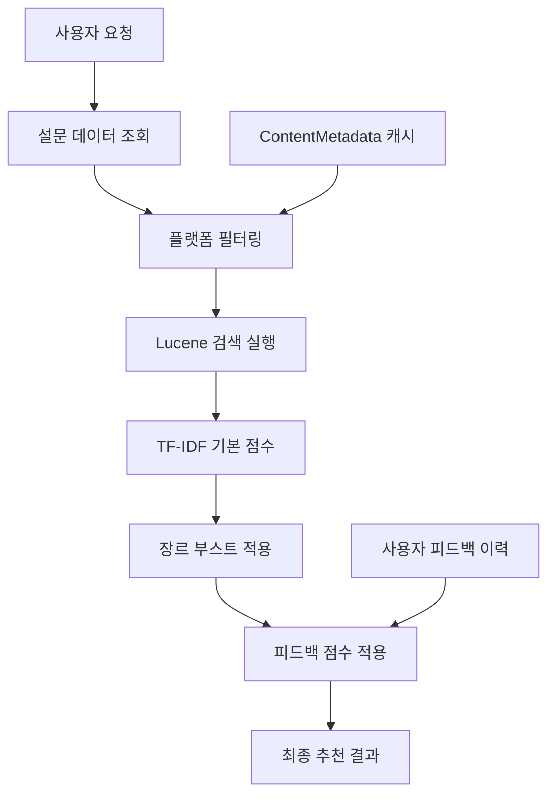

  <h1> Firefly, OTT 콘텐츠 추천 서비스

# 1. 프로젝트 개요
## 1-1. 프로젝트 소개
  - **팀 이름** UDT(Uplus Dream Team)
  - **프로젝트명:** Firefly
  - **프로젝트 기간:** 2025.7.1 ~ 2025.8.12
  - **프로젝트 형태:** 기업 연계 프로젝트
 
## 1-2. 프로젝트 배경 및 문제 정의
> 1. **OTT 콘텐츠 과잉**
>    * 국내 OTT 시장 규모: 2023년 약 1.4조원.
>    * 20~30대가 전체 이용자의 80% 이상, 구독 플랫폼 평균 2.8개 보유.
>    * 방대한 선택지로 ‘무엇을 볼지’ 고민에 평균 10~20분 이상 소모.
> 2. **통합 추천 서비스 부재**
>    * 플랫폼별 앱을 오가며 콘텐츠를 검색해야 하는 불편.
>    * 기존 서비스(예: 키노라이츠)는 최소 10편 평가 후 추천, 실시간 개인화 한계.
>    * 능동적 피드백 수집의 어려움
> 3. **‘좋아요/싫어요’ 클릭률 저조, 피드백 데이터 부족.**

## 1-3. 목표
 ### 스트리밍 성향 파악 및 직관적 UI(릴스)를 통해 OTT 콘텐츠를 추천한다. 이를 통해, 탐색 시간을 30초 내로 단축하여 빠르게 유입과 퇴장을 목표로 한다.
  ### 세부 목표
> 1. **초기 성향 설정**
>    * 회원가입 시 OTT 구독 플랫폼·선호 장르 설문.
> 2. **스와이프 기반 실시간 피드백**
>    * 릴스형 숏폼 UI, 오른쪽 스와이프 좋아요, 왼쪽 스와이프 싫어요, 아래 관심없음.
> 3. **구독 플랫폼 통합 추천**
>    * 구독 중인 OTT 콘텐츠 우선 추천, 미구독 콘텐츠 병행 노출.
> 4. **마이페이지 피드백 수정**
>    * 이전 피드백 히스토리 수정 기능 제공, 추천 알고리즘에 반영.
> 5. **OTT 콘텐츠 필터링해서 보기**

---
# 2. 기술적 특징
  ## 2-1. 아키텍쳐
  ## Backend 
  1. Spring Boot 인증·인가, API, 추천 알고리즘 모듈 포함
  2. Recommendation Engine: Spring Boot Lucene 라이브러리를 통해, TF‑IDF 기반 Content‑based Filtering 서비스로 콘텐츠 추천
  
  ### 2-1-1. 시스템 아키텍쳐
   
  <table align="center">
  <tr>
    <td width="50%">
      

      
      

    </td>
  </tr>
  </table>
   

  ### 2-1-3. DB 구조(ERD)
   
  <table align="center">
  <tr>
    <td width="53%">
      

      
      

    </td>
  </tr>
  </table>
   
 
  ### 2-1-4. 콘텐츠 추천 알고리즘 흐름도

**3단계 점수 계산 시스템**으로 정교한 개인화 추천을 구현:
1. **Lucene TF-IDF 기본 점수** (콘텐츠 유사도)
2. **설문 기반 장르 부스트** (사용자 선호 장르 가중치)
3. **피드백 기반 점수 조정** (실제 사용자 행동 반영)

  

  # 3. 기술 스택

  ## 3-1. Backend

  |사용 기술 |  |역할|사용 이유|
  |:-----------|:-----------|:---------------|:---------------|
  |SpringBoot   (ver. 3.3.12)| | Backend FrameWork | REST API 구축과 의존성 관리가 용이|
  |JAVA   (ver. 17)|  | Backend 언어| 안정성과 대규모 서비스에 적합 |
  |Gradle| | 프로젝트 build 관리 | Build 자동화 및 의존성 관리에 용이 |
  |JUnit| | 단위 테스트 FrameWork | 코드 안정성과 회귀 테스트 보장을 위해 사용 |
  |Lucene|  | 분산 검색 엔진 | 콘텐츠 추천 알고리즘을 위해 사용 |

  ## 3-4. DataBase
  |사용 기술 (버전) |  | 역할 | 사용 이유 |
  |:-----------|:-----------|:---------------|:---------------|
  | Mysql |  | 데이터 관리 |  회원, 설문, 피드백, 콘텐츠 데이터 관리 |
  | Radis |  | 세션 캐싱 및 응답 속도 개선 | 리프레시 토큰, 블랙리스트 토큰 관리 |

 ## 3-5. Infra

|사용 기술 |  | 역할 | 사용 이유 |
|:-----------|:-----------|:---------------|:---------------|
|AWS EC2|  | 서비스 배포 서버 | 안정적인 서비스 운영과 유연한 인프라 확장 |
|AWS RDS|  | 관계형 DB 호스팅 | 관리형 DB로 백업, 보안, 장애 대응 용이 |
|AWS LoadBalancer|  | 트래픽 분산 | 서비스 가용성 및 확장성 확보 |
|Docker|  | 컨테이너 환경 | 환경 일관성 유지 및 배포 자동화 |
|GitHub Actions|  | CI/CD 자동화 | 배포 자동화로 개발 효율성, 생산성 향상 |

---

# 4. 기술적 고민
  ## 4-1. GraphQL vs RestAPI
  * GraphQL 장점: 클라이언트가 필요한 데이터만 정확히 요청 가능해 over-fetch/under-fetch 문제 해소
  * GraphQL 단점: 초기 학습 비용 및 서버·스키마 복잡도 증가, 캐싱 전략이 REST만큼 성숙하지 않음

  * REST API 장점: 표준 HTTP 메서드와 URI 사용, CDN·로드밸런서 등 인프라 캐싱 활용 우수, 구현·디버깅 용이
  * REST API 단점: 고정된 엔드포인트 응답 스펙으로 클라이언트 요구사항 변화 시 over-fetch 발생 가능

  **RESTAPI 방식을 선택했다.**
  * 팀원 모두 GraphQL보다 REST API에 능숙하여 구축·테스트·디버깅에 효율적이라 생각
  * 특히, 로드밸런서등 인프라 캐싱 활용으로 초기 MVP 단계에서 빠른 개발 및 안정적인 성능 확보가 가능하다고 판단해 REST API를 사용

---
